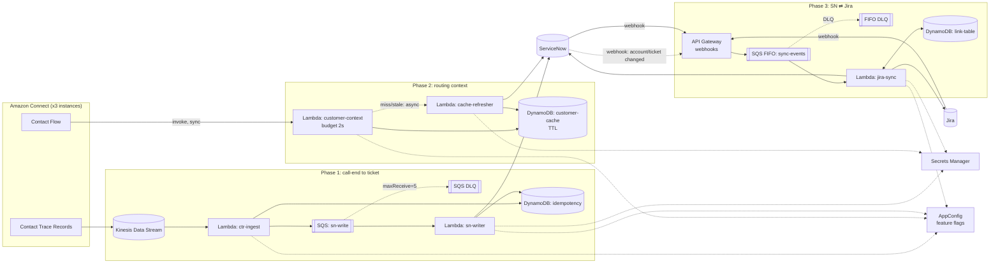

# Connect / ServiceNow / Jira integration

This is my take on the multi-team call center integration challenge. It covers auto-logging calls to ServiceNow, pulling customer context into routing, and syncing technical tickets with Jira, plus how I'd ship it without disturbing what already runs.

A note on scope: this is a design submission. The code focuses on the integration paths where correctness is most important: duplicate prevention, the ServiceNow client, customer-context lookup, and Jira loop prevention. The logic has unit tests, but it has not been run against real Connect, AWS, ServiceNow, or Jira.

To run the tests: `python -m unittest discover -s tests -v` (standard library only).

## The short version

Nothing on a live call should ever wait on ServiceNow, so the only synchronous piece is the routing lookup, and it has a hard time limit and a default answer. Everything else goes through queues so an outage on either side just means a delay. Every write is keyed on an ID that doesn't change (the call's `InitialContactId`, or the ServiceNow/Jira pair), so retries and replays are safe. Anything new ships dark behind flags, one team at a time.

## Service choices

- **Kinesis** for call records. Connect can stream CTRs to it natively, it keeps order per contact, and I can replay it if something downstream breaks for a few hours.
- **DynamoDB** for the idempotency records, the customer cache and the Jira/ServiceNow link table. Conditional writes give me an atomic "create once", and TTL handles cache expiry.
- **SQS** between ingest and ServiceNow, with a DLQ. It retries per message, so one bad record doesn't block the rest, and capping Lambda concurrency keeps me under ServiceNow's rate limits. The Jira sync uses a FIFO queue grouped by ticket so events for one ticket are handled in order.
- **Lambda** for everything. Volume is only a couple thousand calls a day, so there's no reason to run anything.
- **Secrets Manager** for credentials and **AppConfig** for feature flags and kill switches.
- **Terraform** for infrastructure (reasons in DEPLOYMENT.md).

## What's in the repo

- `ARCHITECTURE.md`: the three phases in detail
- `IDEMPOTENCY.md`: how duplicates are prevented
- `DEPLOYMENT.md`, `ROLLBACK.md`, `MONITORING.md`
- `src/lambdas/`: ctr_ingest, sn_writer, customer_context, jira_sync
- `src/lib/`: idempotency claim logic, ServiceNow client, small helpers
- `tests/`: unit tests for the claim/lease logic, idempotent create, and the Jira loop guards
- `terraform/main.tf`: skeleton of the core resources

## Assumptions I'd want to confirm

- ServiceNow lets us add a unique custom field (`u_connect_contact_id`) to the interaction table and fire outbound REST calls from business rules.
- Customers can be identified from the caller's phone number. If the match is ambiguous I return "unknown" instead of guessing.
- The existing deployment system can run a Terraform step or call a pipeline.
